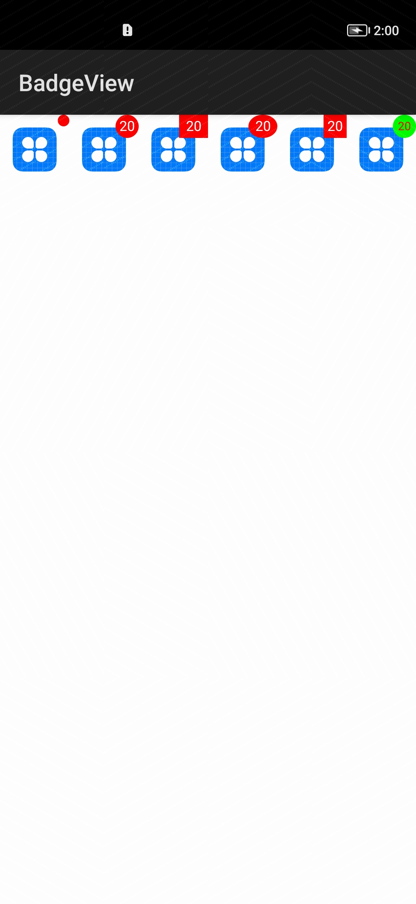

# BadgeView

BadgeView是个消息提醒小红点，可以修改红点样式

## 演示
|设置滑动背景颜色 | 
|:---:|
||

## 主要特征
 * 支持修改提醒中数字是否显示
 * 支持修改提醒红点的样式
 * 支持修改提醒的颜色，大小
 
## entry运行要求
  通过DevEco studio,并下载openHarmonySDK
  将项目中的build.gradle文件中dependencies→classpath版本改为对应的版本（即你的IDE新建项目中所用的版本）
 
 ## 集成
 
 ```
方式一：
通过library生成har包，添加har包到libs文件夹内
在entry的gradle内添加如下代码
implementation fileTree(dir: 'libs', include: ['*.jar', '*.har'])

方式二：
allprojects{
    repositories{
        mavenCentral()
    }
}
implementation 'io.openharmony.tpc.thirdlib:badgeview:1.0.3'
 ```

BadgeView使用说明：
* 简单使用
``` 
BadgeFactory.createDot(this).setBadgeCount(20).bind(imageView);
BadgeFactory.createCircle(this).setBadgeCount(20).bind(imageView);
BadgeFactory.createRectangle(this).setBadgeCount(20).bind(imageView);
BadgeFactory.createOval(this).setBadgeCount(20).bind(imageView);
BadgeFactory.createSquare(this).setBadgeCount(20).bind(imageView);
BadgeFactory.createRoundRect(this).setBadgeCount(20).bind(imageView);
```
* 扩展使用
``` 
BadgeFactory.create(this)
.setTextColor(Color.White)
.setWidthAndHeight(25,25)
.setBadgeBackground(Color.Red)
.setTextSize(10)
.setBadgeGravity(Gravity.Right|Gravity.Top)
.setBadgeCount(20)
.setShape(BadgeView.SHAPE_CIRCLE)
.setSpace(10,10)
.bind(view);
```

## License
```
    Copyright 2016 AllenLiu.

    Licensed to the Apache Software Foundation (ASF) under one or more contributor
    license agreements. See the NOTICE file distributed with this work for
    additional information regarding copyright ownership. The ASF licenses this
    file to you under the Apache License, Version 2.0 (the "License"); you may not
    use this file except in compliance with the License. You may obtain a copy of
    the License at

    http://www.apache.org/licenses/LICENSE-2.0

    Unless required by applicable law or agreed to in writing, software
    distributed under the License is distributed on an "AS IS" BASIS, WITHOUT
    WARRANTIES OR CONDITIONS OF ANY KIND, either express or implied. See the
    License for the specific language governing permissions and limitations under
    the License.
```