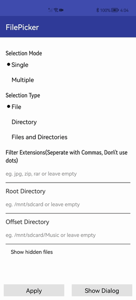

# FilePicker

#### 项目介绍
- 项目名称：FilePicker
- 所属系列：openharmony的第三方组件适配移植
- 功能：从设备存储中选择文件/目录。
- 项目移植状态：主功能完成
- 调用差异：无
- 开发版本：sdk6，DevEco Studio 2.2 Beta1
- 基线版本：Release v8.0.19

#### 效果演示
</img>

#### 安装教程

1.在项目根目录下的build.gradle文件中，
 ```
 allprojects {
    repositories {
        maven {
            url 'https://s01.oss.sonatype.org/content/repositories/releases/'
        }
    }
 }
```
2.在entry模块的build.gradle文件中，
 ```
 dependencies {
    implementation('com.gitee.chinasoft_ohos:FilePicker:1.0.1')
    ......
 }
```
在sdk6，DevEco Studio 2.2 beta1下项目可直接运行 如无法运行，
删除项目.gradle,.idea,build,gradle,build.gradle文件， 
并依据自己的版本创建新项目，将新项目的对应文件复制到根目录下

#### 使用说明

1、首先创建一个DialogProperties：
 ```
 DialogProperties properties = new DialogProperties();
```
2、使用DialogConfig类为每个对话框属性赋值。
```
      properties.selection_mode = DialogConfigs.SINGLE_MODE;
      properties.selection_type = DialogConfigs.FILE_SELECT;
      properties.root = new File(DialogConfigs.DEFAULT_DIR);
      properties.error_dir = new File(DialogConfigs.DEFAULT_DIR);
      properties.offset = new File(DialogConfigs.DEFAULT_DIR);
      properties.extensions = null;
      properties.show_hidden_files = false;
```
3、接下来，在点击显示Dialog时，创建实例FilePickerDialog。
```
     FilePickerDialog dialog = new FilePickerDialog(this, properties);
     dialog.setTitle("Select a File");
     dialog.setPositiveBtnName("Select");
     dialog.setNegativeBtnName("Cancel");
     dialog.onStart();
     dialog.show();
```
4、接下来，添加DialogSelectionListener到FilePickerDialog如下：
```
dialog.setDialogSelectionListener((files) -> {
                int size = listItem.size();
                listItem.clear();
                mFileListAdapter.notifyDataSetItemRangeRemoved(0, size);
                for (String path : files) {
                    File file = new File(path);
                    ListItem item = new ListItem();
                    item.setName(file.getName());
                    item.setPath(file.getCanonicalPath());
                    listItem.add(item);
                }
                mFileListAdapter.notifyDataSetItemRangeInserted(0, listItem.size());
                fileList.setHeight(listItem.size() * 150);
            });
```

#### 测试信息

CodeCheck代码测试无异常

CloudTest代码测试无异常

病毒安全检测通过

当前版本demo功能与原组件基本无差异

#### 版本迭代

- 1.0.1

#### 版权和许可信息
```
Copyright (C) 2019 FilePicker

Licensed under the Apache License, Version 2.0 (the "License");
you may not use this file except in compliance with the License.
You may obtain a copy of the License at

   http://www.apache.org/licenses/LICENSE-2.0

Unless required by applicable law or agreed to in writing, software
distributed under the License is distributed on an "AS IS" BASIS,
WITHOUT WARRANTIES OR CONDITIONS OF ANY KIND, either express or implied.
See the License for the specific language governing permissions and
limitations under the License.
```