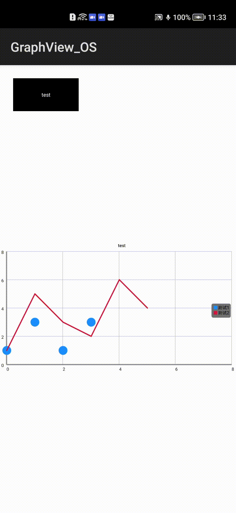

# GraphView_openharmony

### 折线图/圆点图/柱状图



## 安装说明


Method 1:For using Graphview module in sample app ,add the
below dependency to generate hap/har,Modify entry/build.gradle as below:


    dependencies {
    implementation fileTree(dir: 'libs', include: ['*.jar','*.har'])
    testCompile'junit:junit:4.12'
    implementation project(':graphveiw')
    }

Method 2:For using Graphview in separate application using har file ，generate .har package through library and add the har file to the entry/libs folder.Modify entry/build.gradle as below:

    implementation fileTree(dir: 'libs', include: ['*.jar','*.har'])

Method 3:For using Graphview in separate application using maven dependency,modify entry/build.gradle as  below:

     dependencies {
        implementation 'io.openharmony.tpc.thirdlib:graphView-library:1.0.3'
     }


## 使用说明 

#### 一.GraphView 介绍

       <com.jjoe64.graphview.GraphView
         ohos:id="$+id:graphView"
         ohos:height="200vp"
         ohos:width="match_parent"/>

        GraphView graph = (GraphView) findComponentById(ResourceTable.Id_graphView);
         LineGraphSeries<DataPoint> series = new LineGraphSeries<DataPoint>(new DataPoint[] {
              new DataPoint(0, 1),
              new DataPoint(1, 5),
              new DataPoint(2, 3),
              new DataPoint(3, 2),
              new DataPoint(4, 6)
         });
         graph.addSeries(series);

#### 二.GraphViewXML 自定义介绍

```
    <com.jjoe64.graphview.helper.GraphViewXML
     ohos:id="$+id:graphViewXml"
     ohos:height="200vp"
     ohos:width="match_parent"
     ohos:seriesData="0=5;1=0;2=4;3=2"
     ohos:seriesType="points"
     ohos:seriesTitle="test5"
     ohos:seriesColor="#1E90FF"
     ohos:title ="test1"
```

|   属性名    |  类型  |       示例        |             描述             |
| :---------: | :----: | :---------------: | :--------------------------: |
| seriesData  | String | "0=5;1=0;2=4;3=2" |       字符性的数据注入       |
| seriesType  | String |  points/bar/line  | 图像样式例如柱状图，圆点图等 |
| seriesColor | String |     "#1E90FF"     |           颜色设置           |
|    title    | String |      "test1"      |           头部标题           |
| seriesTitle | String |      "test5"      |           标签名称           |

### 说明

本库目前只支持静态数据图形展示
不支持滑动/缩放以及如下相关 API

1.StaticLabelsFormatter staticLabelsFormatter =
new StaticLabelsFormatter(graphView_01,new String[] {"old", "new"},new String[] {"high", "low"});
此 API 问题为原三方库遗留问题，当静态标签格式化程序传递 2 个不同的垂直标签时，它显示两次第一个标签，而不是显示两个集合标签。，由于代码复杂性和功能耦合性暂无法找到解决办法  
 2.public class GraphView 内 takeSnapshotAndShare
此 API 与项目功能实现无关是一个分享功能， 因此考虑其价值与困难程度暂不考虑实现此功能  
 2.public class LineGraphSeries 内 public void setDrawAsPath
API（AccelerateInterpolator）缺失并且未找到替代方案导致此类相关功能无法实现
3.public class LineGraphSeries 内 public void setAnimated(boolean animated)
API（AccelerateInterpolator）缺失并且未找到替代方案导致此类相关功能无法实现
4.public class BarGraphSeries 内 public void setAnimated(boolean animated)
API（AccelerateInterpolator）缺失并且未找到替代方案导致此类相关功能无法实现
5.public class Viewport 内 OverScroller / onScroll
涉及到缺失 API（AccelerateInterpolator）API 缺失并且未找到替代方案导致此类相关功能无法实现
6.public class LineGraphSeries 内 AccelerateInterpolator
API 缺失并且未找到替代方案导致此类相关功能无法实现  
7.如果 2 个图形系列具有相同的系列标题，具有不同的系列颜色，则图例中仅显示第一个系列信息

### End
