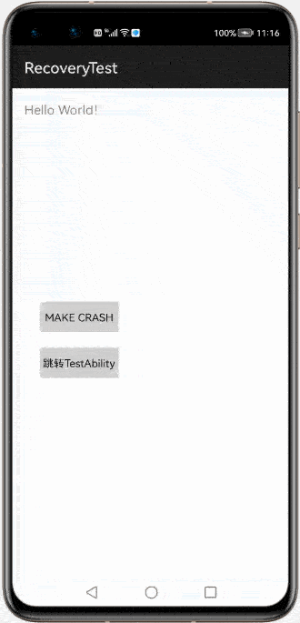

# **Recovery**


## 项目介绍

- 项目名称：Recovery
- 所属系列：openharmony的第三方组件适配移植
- 功能：捕获应用崩溃框架，并能恢复崩溃页面
- 项目移植状态：已完成
- 调用差异：无
- 开发版本：sdk6，DevEco Studio2.2 Beta1
- 基线版本：Release 1.0.0

## 演示效果

</img>
## 安装教程

1. 在项目根目录下的build.gradle文件中添加。
```
allprojects {
    repositories {
        maven {
             url 'https://s01.oss.sonatype.org/content/repositories/releases/'
        }
    }
}
```
2. 在entry模块下的build.gradle文件中添加依赖。
```
dependencies {
       implementation('com.gitee.chinasoft_ohos:Recovery:1.0.1')
}
```

在sdk6，DevEco Studio2.2 beta1下项目可直接运行 如无法运行，删除项目.gradle,.idea,build,gradle,build.gradle文件， 并依据自己的版本创建新项目，将新项目的对应文件复制到根目录下

## 使用说明

1. 在entry下的MyApplication中调用

```java

public class MyApplication extends AbilityPackage {
    @Override
    public void onInitialize() {
        super.onInitialize();


        Recovery.getInstance()
                .debug(true)
                .recoverInBackground(false)
                .recoverStack(true)
                .mainPage(MainAbility.class)
                .recoverEnabled(true)
                .callback(new MyCrashCallback())
                .silent(false, Recovery.SilentMode.RECOVER_ACTIVITY_STACK)
                .skip(TestAbility.class)
                .init(this);
    }

    static final class MyCrashCallback implements RecoveryCallback {
        @Override
        public void stackTrace(String exceptionMessage) {
            RecoveryLog.e("exceptionMessage:" + exceptionMessage);
        }

        @Override
        public void cause(String cause) {
            RecoveryLog.e("cause:" + cause);
        }

        @Override
        public void exception(String exceptionType, String throwClassName, String throwMethodName, int throwLineNumber) {
            RecoveryLog.e("exceptionType:" + exceptionType);
            RecoveryLog.e("throwClassName:" + throwClassName);
            RecoveryLog.e("throwMethodName:" + throwMethodName);
            RecoveryLog.e("throwLineNumber:" + throwLineNumber);
        }

        @Override
        public void throwable(Throwable throwable) {

        }
    }

}
```

2.重启功能需要在entry模块的config.json中 module 加入属性mainAbility

```json
"module": {
  "mainAbility" : "启动页的路径",
   .....
}
```

3.异常信息文件保存路径：/data/com.zxy.recovery.test/files/recovery_crash/

## **方法说明**

|      Argument      |           Type           |                           Function                           |
| :----------------: | :----------------------: | :----------------------------------------------------------: |
|       debug        |         boolean          |                      是否开启debug模式                       |
| recoverInBackgroud |         boolean          |          当应用在后台时发生Crash，是否需要进行恢复           |
|    recoverStack    |         boolean          |       是否恢复整个Ability Stack，否则将恢复栈顶Ability       |
|      mainPage      | Class<? extends Ability> |                          回退的界面                          |
|      callback      |     RecoveryCallback     |                      发生Crash时的回调                       |
|       silent       |    boolean,SilentMode    | 是否使用静默恢复，如果设置为true的情况下，那么在发生Crash时将不显示RecoveryAbility界面来进行恢复，而是自动的恢复Ability的堆栈和数据，也就是无界面恢复 |

**SilentMode**

> 1. RESTART - 重启应用
> 2. RECOVER_ACTIVITY_STACK - 恢复Activity堆栈
> 3. RECOVER_TOP_ACTIVITY - 恢复栈顶Activity
> 4. RESTART_AND_CLEAR - 重启应用并清空缓存数据


## 备注

（偶发现象）在模拟器首次运行，执行崩溃逻辑，捕获不到崩溃信息！！！

## 测试信息

CodeCheck代码测试无异常

CloudTest代码测试无异常

病毒安全检测通过

当前版本demo功能与原组件基本无差异


## 版本迭代

- 1.0.1

## 版权和许可信息

```
 Copyright 2016 zhengxiaoyong

   Licensed under the Apache License, Version 2.0 (the "License");
   you may not use this file except in compliance with the License.
   You may obtain a copy of the License at

       http://www.apache.org/licenses/LICENSE-2.0

   Unless required by applicable law or agreed to in writing, software
   distributed under the License is distributed on an "AS IS" BASIS,
   WITHOUT WARRANTIES OR CONDITIONS OF ANY KIND, either express or implied.
   See the License for the specific language governing permissions and
   limitations under the License.
```

