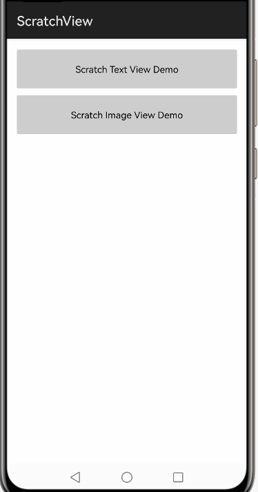
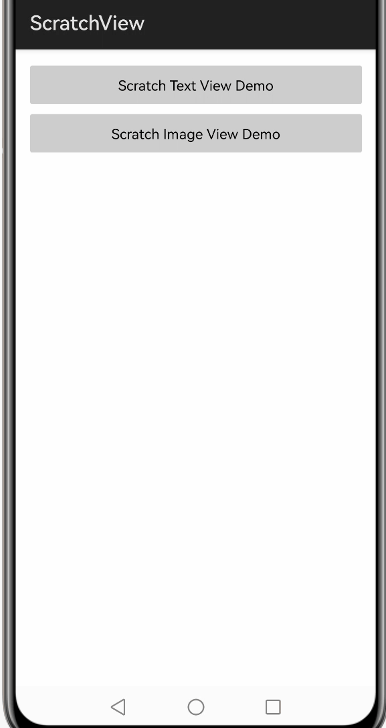

# ScratchView

**本项目是基于开源项目ScratchView进行ohos化的移植和开发的，可以通过项目标签以及github地址（https://github.com/sharish/ScratchView ）追踪到原项目版本**

## 项目介绍

- 项目名称：ScratchView
- 所属系列：ohos的第三方组件适配移植
- 功能：刮刮卡效果控件。
- 项目移植状态：完成
- 调用差异：无
- 项目作者和维护人：hihope
- 联系方式：hihope@hoperun.com
- 原项目Doc地址：https://github.com/sharish/ScratchView
- 原项目基线版本：v1.1, sha1:2cc876748fd21ee6f1fb710a30566a4dbda8458b
- 编程语言：Java
- 外部库依赖：无

#### 效果展示

|     ScratchImageView                |        ScratchTextView              | 
| ----------------------------  | ----------------------------- | 
|  |    |

## 安装教程

方法1.

1. 编译library的har包scratchview.har。
2. 启动 DevEco Studio，将编译的har包，导入工程目录“entry->libs”下。
3. 在moudle级别下的build.gradle文件中添加依赖，在dependences标签中增加对libs目录下har包的引用。
```
dependencies {
    implementation fileTree(dir: 'libs', include: ['*.jar', '*.har'])
	……
}
```
4. 在导入的har包上点击右键，选择“Add as Library”对包进行引用，选择需要引用的模块，并点击“OK”即引用成功。

方法2.

1. 在工程的build.gradle的allprojects中，添加HAR所在的Maven仓地址
```
repositories {
    maven {
        url 'http://106.15.92.248:8081/repository/Releases/'
    }
}
```
2. 在应用模块的build.gradle的dependencies闭包中，添加如下代码:
```
dependencies {
    implementation 'com.cooltechworks.ohos:scratchview:1.0.0'
}
```

## 使用说明

1. gradle中添加依赖:
```
implementation 'com.cooltechworks.ohos:scratchview:1.0.0'
```

2. 控件添加到布局文件中:
```xml
<com.cooltechworks.views.ScratchTextView
        ohos:id="$+id:scratch_view"
        ohos:width="110vp"
        ohos:height="48vp"
        ohos:text_alignment="center|end"
        ohos:bottom_padding="10vp"
        ohos:left_padding="30vp"
        ohos:top_padding="10vp"
        ohos:text="$string:flat_200"
        ohos:text_color="#999999"
        ohos:text_size="15fp"
         />
```
```xml
<com.cooltechworks.views.ScratchImageView
        ohos:id="$+id:sample_image"
        ohos:width="200vp"
        ohos:height="200vp"
        ohos:layout_alignment="center"
        ohos:scale_mode="zoom_center"
        ohos:top_margin="20vp"
        ohos:background_element="$color:white"
        ohos:image_src="$media:img_sample2">
    </com.cooltechworks.views.ScratchImageView>
```

3. 设置监听
```java
    scratchTextView.setRevealListener(new ScratchTextView.IRevealListener() {
            @Override
            public void onRevealed(ScratchTextView tv) {
                // on reveal
            }
    
            @Override
            public void onRevealPercentChangedListener(ScratchTextView stv, float percent) {
                // on percent reveal.
            }
        });
```

```java
    ScratchImageView scratchImageView = (ScratchImageView) findComponentById(ResourceTable.Id_sample_image);
    
    scratchImageView.setRevealListener(new ScratchImageView.IRevealListener() {
        @Override
        public void onRevealed(ScratchImageView tv) {
            // on reveal
        }
    
        @Override
        public void onRevealPercentChangedListener(ScratchImageView siv, float percent) {
            // on image percent reveal
        }
    });
```

## 版本迭代

- 1.0.0

## 版权和许可信息

```
Copyright 2016 Harish Sridharan

Licensed under the Apache License, Version 2.0 (the "License");
you may not use this file except in compliance with the License.
You may obtain a copy of the License at

   http://www.apache.org/licenses/LICENSE-2.0

Unless required by applicable law or agreed to in writing, software
distributed under the License is distributed on an "AS IS" BASIS,
WITHOUT WARRANTIES OR CONDITIONS OF ANY KIND, either express or implied.
See the License for the specific language governing permissions and
limitations under the License.
```


