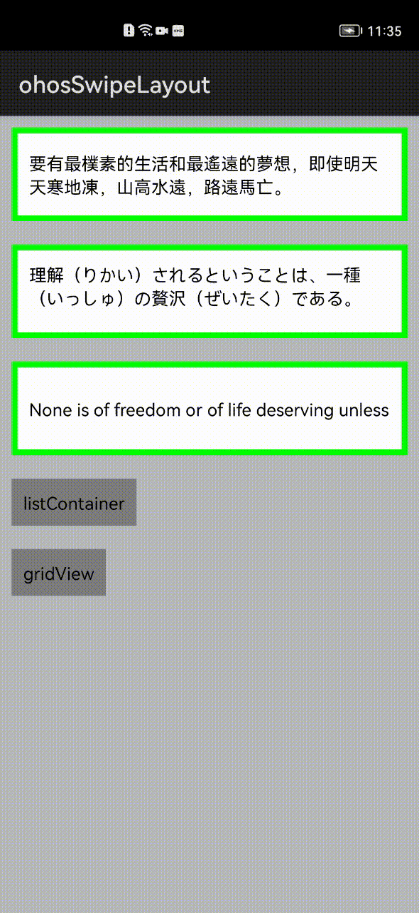

## Demo:


## Download
Gradle:

```groovy
repositories {
    mavenCentral()
}

dependencies{
    implementation 'io.openharmony.tpc.thirdlib:ohosSwipeLayout:1.0.0'
}
```
### Normal



### Single-column ListContainer


### Multi-column ListContainer


## Usage

### Xml

```xml
    <com.daimajia.swipe.SwipeLayout
            ohos:margin="10vp"
            ohos:id="$+id:swipe1"
            ohos:width="match_parent"
            ohos:height="80vp"
            app:clickToClose="true">
        ....
    </com.daimajia.swipe.SwipeLayout>
```

### Java

```java
    swipe1 = (SwipeLayout) findComponentById(ResourceTable.Id_swipe1);
    swipe1.addDrag(SwipeLayout.DragEdge.Left, ResourceTable.Id_bottom_wrapper);
    swipe1.addDrag(SwipeLayout.DragEdge.Right, ResourceTable.Id_bottom_wrapper2);
    swipe1.addDrag(SwipeLayout.DragEdge.Top, starBottView);
    swipe1.addDrag(SwipeLayout.DragEdge.Bottom, starBottView);
```

## AttrSet

|name|format|description|
|:---:|:---:|:---:|
| clickToClose| boolean | need click to close when open |
| show_mode | int | show mode (LayDown or PullOut) |
