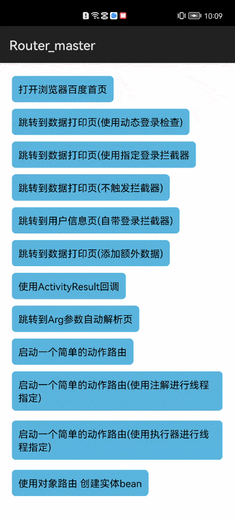
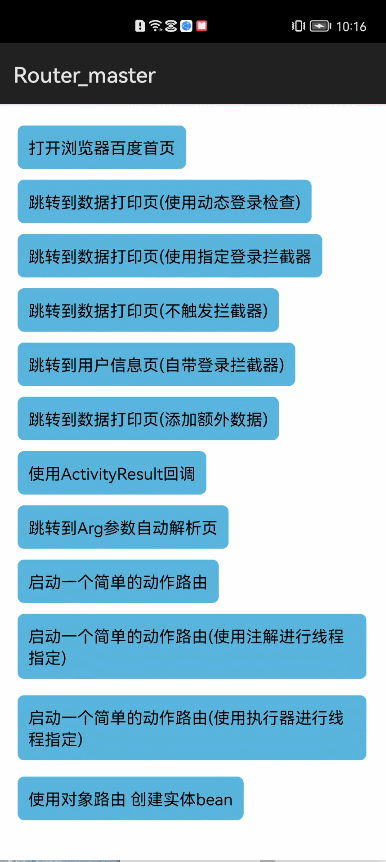

# Router


## 项目介绍

- 项目名称：Router
- 所属系列：openharmony的第三方组件适配移植
- 功能：一款简单的，支持在单品、组件化、插件化等环境下使用的路由框架,通过一行url去指定打开指定页面Ability的框架.充分做到页面间解耦，
  自动化 可自动解析标准url参数
  安全: 路由启动过程中。全程catch住异常并通知用户。完全不用担心crash问题。
  强大的拦截器:与大部分的路由不同。提供三种路由拦截器机制，对应不同业务下使用。
  方便: 使用apt注解生成路由表，配置方便，易维护。
  灵活: 配置路由表方式多样，满足你在任意条件下进行使用。
  支持两种路由:页面路由与动作路由。
  支持重启路由:路由被拦截后。可通过一行代码无缝恢复重启路由。在登录检查中会很有用。
  高度可定制:单品、组件化完美支持，对于插件化环境。也可以针对性的定制使用
- 项目移植状态：已完成
- 调用差异：无
- 开发版本：sdk6，DevEco Studio2.2 Beta1
- 基线版本：Release 2.8.6

## 演示效果

</img>
</img>
</img>

## 安装教程

### 1.远程依赖方式

##### 1.在项目根目录下的build.gradle文件中，

 ```
allprojects {
   repositories {
       maven {
           url 'https://s01.oss.sonatype.org/content/repositories/releases/'
       }
   }
}
 ```

##### 2.在entry模块的build.gradle文件中，

 ```
dependencies {
      implementation 'com.gitee.chinasoft_ohos:router_api:1.0.1'
      annotationProcessor 'com.gitee.chinasoft_ohos:router_compiler:1.0.1'
   ......  
}
 ```

### 2.本地依赖方式

 ```
 dependencies {

   annotationProcessor project(path:':router_compiler')
   implementation project(path:':router_api')
    
 }
 ```

在sdk6，DevEco Studio2.2 Beta1下项目可直接运行
如无法运行，删除项目.gradle,.idea,build,gradle,build.gradle文件，
并依据自己的版本创建新项目，将新项目的对应文件复制到根目录下

## 使用说明

#### 1.为Ability添加路由规则

 在 Appaction 中指定路由前缀与路由表生成包名

    @RouteConfig( baseUrl = "haoge://page/",// 路由前缀：用于结合RouterRule合成完整的路由链
    pack = "com.haoge.studio") //路由表生成包名：配置后。路由表生成类将会放置于builder->generated-> source->annotaion->debug下
    public class MyApplication extends AbilityPackage {...}

为目标页指定路由规则链接
// 在目标Ability上添加RouterRule注解，添加对应的路由规则
// 同一目标页可以添加多个不同的路由链接。

    @RouterRule({
    	// 可只指定path, 此种数据会与RouteConfig中的baseUrl进行结合:
    	// 最终完整链接为：haoge://page/example
    	
    	"example",
    	// 也可直接指定完整链接
    	
    	"total://example"
    	
    	})
    class ExampleActivity extends BaseActivity { ... }

#### 2.注册路由表

经过上面的配置后，编译后即可生成对应的路由表类，生成的路由表类名统一为RouterRuleCreator:

然后即可通过以下代码进行路由表注册使用：

    RouterConfiguration.get().addRouteCreator(new RouterRuleCreator())

#### 3.启动路由

还是以上面的example为例。要使用Router启动ExampleActivity, 使用以下链接进行跳转

    Router.create("haoge://page/example").open(context)

#### 4.启动浏览器打开网页

当路由链接为http/https时，且此时本地的也没有页面配置过此链接地址时，将触发使用跳转浏览器打开链接逻辑

比如浏览器打开百度页面

    Router.create("https://www.baidu.com").open(context)

#### 5.添加额外数据启动

    IntentParams data = new IntentParams();
    Router.create(url)
    	.addExtras(data) // 添加额外数据：Intent.addExtras(bundle)
    	.requestCode(code) // 使用startActivityForResult进行启动
    	.setAnim(in, out) // 设置转场动画。Activity.overridePendingTransition(inAnim, outAnim)
    	.open(context)

#### 6.使用路由回调

路由回调为RouteCallback接口，用于在进行路由启动后，对该次路由事件的状态做回调通知：

    public interface RouteCallback {
    	// 当用于启动的路由链接未匹配到对应的目标页时。回调到此
    	void notFound(Uri uri, NotFoundException e);
    	// 当启动路由成功后，回调到此。可在此通过rule.getRuleClz()获取对应的目标页类名。
    	void onOpenSuccess(Uri uri, RouteRule rule);
    	// 当启动路由失败后，回调到此。
    	void onOpenFailed(Uri uri, Throwable e);
    }

#### 7.使用ActivityResultCallback

ActivityResultCallback接口用于自动处理onAbilityResult逻辑，可有效避免在onAbilityResult中写一堆的判断switch逻辑。是个很棒的特性。

    public interface ActivityResultCallback {
    	void onResult(int resultCode, Intent data);
    }

使用此特性前，需要在BaseAbility中的onAbilityResult方法处，添加上派发方法：

    RouterConfiguration.get()
    	.dispatchActivityResult(this, requestCode, resultCode, data)

然后即可直接使用

// 添加了resultCallback属性后，即可不指定requestCode了。免去了取值的烦恼

    Router.create(url).resultCallback(resultCallback).open(context)

#### 8.使用路由拦截器拦截器

拦截器，顾名思义，就是在路由启动过程中，进行中间状态判断，是否需要拦截掉此次路由事件。使其启动失败。

拦截器的接口名为RouteInterceptor

    public interface RouteInterceptor{
    	// 在此进行状态判断。判断是否需要拦截此次路由事件，当返回true时，代表此次启动事件被拦截
    	boolean intercept (Uri uri, RouteBundleExtras extras, Context context);
    	// 当intercept方法返回true时，此方法被调用。
    	void onIntercepted(Uri uri, RouteBundleExtras extras, Context context);
    }

Router经过长期的迭代，对拦截器进行了详细的分类，提供了三种拦截器提供使用:

1. 全局拦截器：对所有的路由事件生效。

   ```java
    RouterConfiguration.get().setInterceptor(interceptor);
   ```

```
2. 单次拦截器：对当次路由事件生效。

​```java
// 是的你没有看错，可以配置多个不同的拦截器实例
Router.create(url).addInterceptor(interceptor1).addInterceptor(interceptor2).open(context);
```

3. 指定目标的拦截器：对指定的目标页面生效 

// 在配置的RouterRule的目标页，添加此RouteInterceptors注解即可。
// 在此配置的拦截器，当使用路由启动此页面时，即可被触发。

    @RouteInterceptors({CustomRouteInterceptor.class})
    @RouterRule("user")
    public class UserActivity extends BaseActivity {...}

恢复路由的方式
既然路由可以被拦截，那么也可以直接被恢复。

```java
Router.resume(uri, extras).open(context);
```

下面是一个简单的登录拦截实现：

```java
public class LoginInterceptor implements RouteInterceptor {
    @Override
    public boolean intercept(Uri uri, RouteBundleExtras extras, Ability context) {
        // 判断是否已登录。已登录：不拦截、登录：拦截
        return !DataManager.isIsLogin();
    }

    @Override
    public void onIntercepted(Uri uri, RouteBundleExtras extras, Ability context) {
        // 拦截后，将数据传递到登录页去。待登录完成后进行路由恢复
        Operation operation = new Intent.OperationBuilder()
                .withDeviceId("")
                .withBundleName("com.lzh.nonview.router.demo")
                .withAbilityName("com.lzh.nonview.router.demo.LoginAbility")
                .build();
        Intent intent = new Intent();
        intent.setParam("uri", uri);
        intent.setParam("extras", extras);
        intent.setParam("extrasIntentPararms", extras.getExtras());
        intent.setOperation(operation);
        context.startAbility(intent);
    }
}

public class LoginAbilitySlice extends AbilitySlice {
    private Uri uri = null;
    private RouteBundleExtras extras = null;
    private IntentParams intentParams = null;

    @Override
    public void onStart(Intent intent) {
    //登录成功
     Router.resume(uri.toString(),extras).open(getAbility());
    }
```

#### 9.使用动作路由

上面主要介绍的页面跳转的路由，也叫页面路由，但实际上。有的时候我们使用路由启动的，并不是需要启动某个页面。而是需要执行一些特殊的操作：比如添加购物车、强制登出等。此时就需要使用动作路由了。

创建动作路由
动作路由通过继承ActionSupport类进行创建：

```java
// 与页面路由一样。添加RouterRule注解配置路由链接即可。
@RouterRule("action/hello")
public class SayHelloAction extends ActionSupport {
	@Override
	public void onRouteTrigger(Context context, Bundle data) {
		//  启动动作路由成功会触发调用此方法。
		Toast.makeText(context, "Hello! this is an action route!", Toast.LENGTH_SHORT).show();
	}
}
```

动作路由的启动方式与页面路由一致:

```java
Router.create("haoge://page/action/hello").open(context)
```

#### 10. 指定动作路由的执行线程

动作路由是用于执行一些特殊的操作的路由，而有时候部分操作是需要在指定线程进行处理的：

动作路由提供两种指定线程的操作：

启动前进行配置(优先级高)：

```java
Router.create(url).setExecutor(executor).open(context);
```

在定制动作路由时，直接指定线程：

```java
@RouteExecutor(CustomExecutor.class)
@RouterRule("action/hello")
public class SayHelloAction extends ActionSupport {...}
```

在没有配置过线程切换器时。默认使用MainThreadExecutor。指定线程为主线程

#### 11. 使用对象路由

```java
User user = Router.createInstanceRouter("haoge://page/creator/user?name=CreatorRouter")
                        .<User>createInstance();
```

对象路由的配置方式是与页面路由,动作路由类似

```java
// 对任意类添加路由配置注解
@RouterRule("haoge://pojo/user")
class Uesr implements ICreatorInjector {
	@Override
	public void inject(IntentParams bundle) {
		// 接收传参
	} 
}

// 然后通过指定的链接，直接获取实例
User user = Router.createInstanceRouter("haoge://pojo/user")
			.createInstance<User>()
```


## 测试信息

CodeCheck代码测试无异常

CloudTest代码测试无异常

病毒安全检测通过

当前版本demo功能与原组件基本无差异


## 版本迭代

1.0.1

## 版权和许可信息

        Copyright 2015 Haoge
    
        Licensed under the Apache License, Version 2.0 (the "License");
        you may not use this file except in compliance with the License.
        You may obtain a copy of the License at
    
         http://www.apache.org/licenses/LICENSE-2.0
    
        Unless required by applicable law or agreed to in writing, software
        distributed under the License is distributed on an "AS IS" BASIS,
        WITHOUT WARRANTIES OR CONDITIONS OF ANY KIND, either express or implied.
        See the License for the specific language governing permissions and
        limitations under the License.