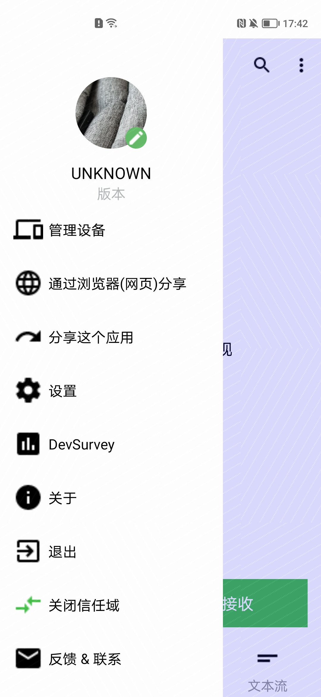
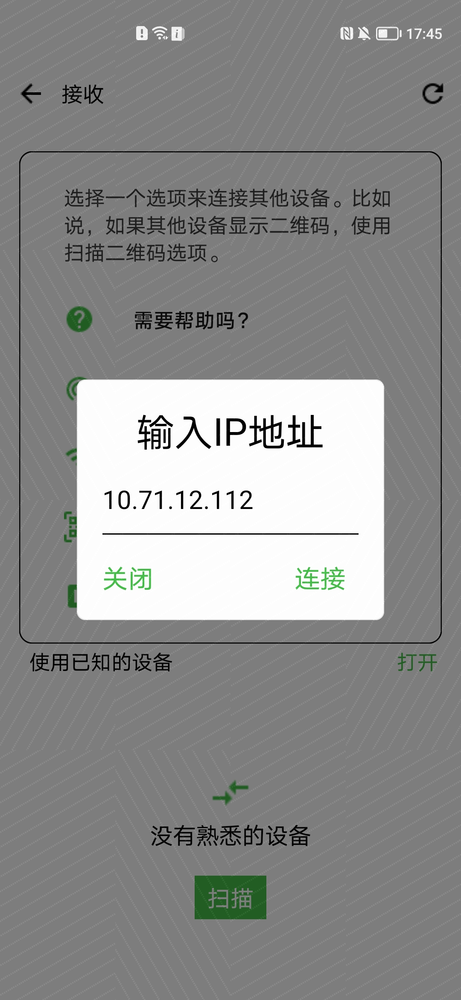
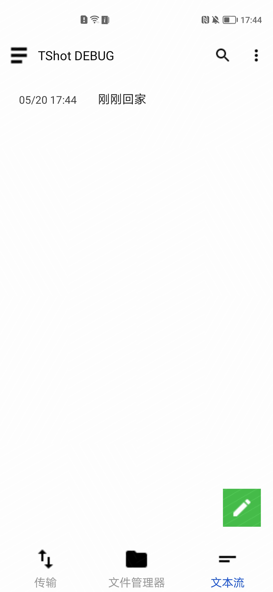
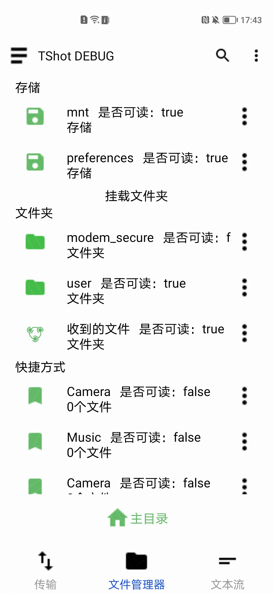
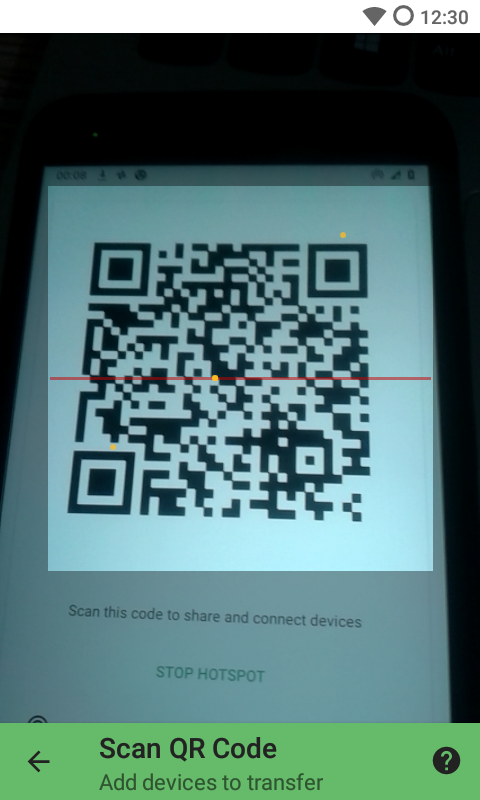

# TrebleShot_ohos

**本项目是基于开源项目 TebleShot 进行 openHarmony 化的移植和开发的，可以通过项目标签以及github地址（ https://github.com/trebleshot/android ）追踪到原安卓项目版本;**
**开始移植时的原组件的基线release版本号: Git commit:4b398c67 [无RLEASE,无TAG]**

#### 项目简介

- 项目名称：TrebleShot
- 所属系列：openHarmony 的APP适配移植
- 功能：通过可用连接，发送和接收文件
- 项目移植状态：已完成
- 调用差异：无
- 开发版本：sdk 5(2.1.1.18)，DevEco Studio 2.1.0.301
- 项目作者和维护人：杜波，蒋建，贺金成，郭平波
- 邮箱：bo.du@archermind.com
- 原项目Doc地址：https://github.com/trebleshot/android

#### 项目介绍

- 编程语言：Java
- TrebleShot在 openHarmony上的移植

#### 安装教程

源码Build方法：
前置条件：下载DevEco Studio 2.1 beta3或更高版本，鸿蒙开发SDK 5，
下载此TrebleShot仓库源码, 导入DevEco Studio，编译，构建HAP/APP;
在工程build/output/子目录下，可看到构建好的鸿蒙TrebleShot HAP应用程序.

#### 它的主要特点

断点传输
即使在出现问题后，也暂停并恢复传输。
多个设备
同时与多个设备共享。
无互联网
无需互联网连接，设置热点并使用 QR 代码连接到热点。
速度优先
在低端设备上比竞争对手工作得更快，最小用户界面优化速度。
大文件
对大小大于平均大小的文件有很大的支持。

#### 使用说明

使用截图：
-

#### 版本迭代

- v1.0.0

#### 版权和许可信息
- This app is licensed under GNU Public License version 2.0 or later version.